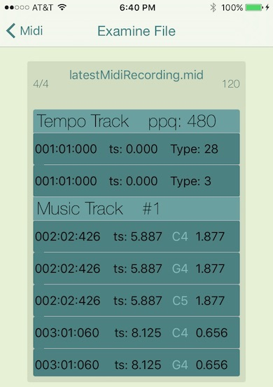

# LoadIt
Is a simple test app which exercises some Core Midi, with a small bit of Core Audio.

Essentially it achieves these goals:

1. Connect with and take input from a connected Physical midi keyboard

2. Load Soundfonts (sf2) into a Sampler AudioUnit

3. Audibly render midi keyboard input using chosen Soundfont instrument

4. Allow virtual input connections from other iOS midi Music apps

5. Record and capture all midi input to a midi disk file

6. Offer visual inspection of the saved midi file

7. Utilize **MIKMIDI opensource midi library** for connection and recording management

Example of #6:

The listing shows this information from the saved midi file

    Column 1          Column 2        Column 3    Column 4
    Bar:Beat:SubBeat  MusicTimeStamp  Note+Octave Duration

The first, top most track is the Tempo track from the midi file, showing `Pulses Per Quarter Note` and any other events written to the tempo track (e.g Time Signature, etc.).

